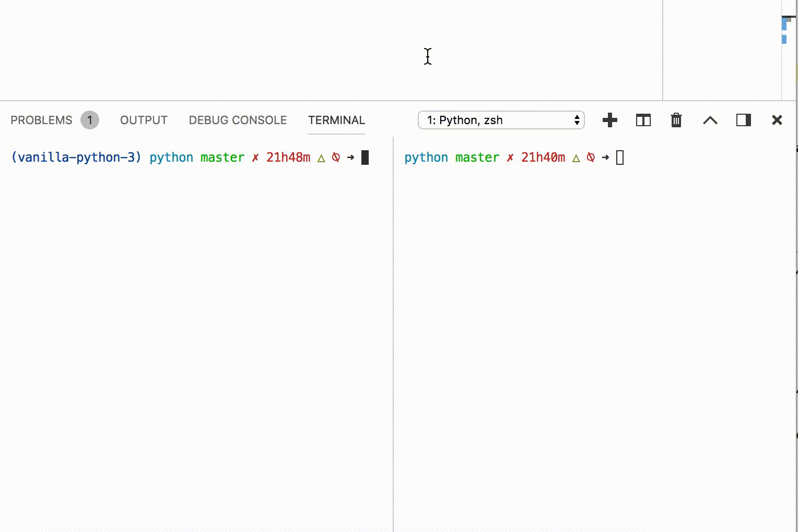

In the process of trying to build a vanilla python HTTP server, I realized that I don't know much about it's inner workings. So while I was stuck learning about sockets, TCP handshakes and protocols, I decided to tackle something that was a little more within my reach thus was born this humble little project. A simple python chat server meant to be used by terminal clients through netcat.

## Context

While playing around with the skeleton of my HTTP server, I would use netcat, a terminal tool to troubleshoot the server and I realized having multiple netcat clients open that it would be pretty easy to make a simple chat server using sockets on python.

## What are we building

What we're trying to build is a chat server. It's basically a simple python program that runs on a chosen port. Clients will try to connect to this server. In our case the clients are going to be terminals with netcat.

Our server is going to receive these connections, assign a username to each client and start listening for their messages. It will then relay the messages from one client to all others.  
Here is a look at the final product.


I know, it might not be impressive, but it's the journey that counts not the destination and we are going to be learning a lot through this journey.

### Sockets

While searching information about different network communication protocols I was bound to stumble on the concept of sockets. So what are sockets exactly?

If we choose to ignore what goes on below the operating system kernel, sockets are a high level concept provided by the OS api to help us abstract the communication of two processes/computers.  
Virtually all operating systems provide us with a set of system calls to create sockets and transmit data through them. Most programming languages have builtin tools/functions to interact with these system calls on a higher level.

In our case, python has a special module called socket that gives all the tools we need to create sockets, receive connections and messages and send messages to connected clients.

### Socket creation

First thing to do is import the socket class from the socket module  

```python
from socket import socket
```

You can then create a socket like this  

```python
server = socket()
```

For our simple server, we won't have to worry about any arguments, but you should know that these arguments can change the behavior of the socket.  

The next step is to bind the socket to a specific endpoint. The bind method takes a tuple containing a hostname and a port as an argument.  

A problem I encountered at this step was choosing the hostname. Here is what I found with some trial and error.  

- `'localhost'`: allows connections only from the same machine through the loopback interface
- `gethostname()`: allow connections only from machines on the same network. no loopback interface
- `'0.0.0.0'`: allow connections from both

```python
server.bind('0.0.0.0', 5000)
```

We're ready to start our server with the socket.listen() method which takes that represents the number of backloged connections that can be stored. The default value seem to be appropriate for our usage.

```python
server.listen()
```

### Accepting connections

Our server is now running on our specified port, but nowhere do we specify tell it to accept connections. The socket.accept() method can help us with that.  
An important thing to know about this method is that it's blocking. What does that mean? Well python as many other languages like c, Java or assembly is synchronous which means that each instruction has to wait for the previous instruction to be done before executing.  
On the polar opposite, some languages like javascript are asynchronous which means that instructions do not wait for previous inscriptions to be done before executing. Each new instruction is added to the event loop and will be processed whens it's ready. So the equivalent of a  `sleep 10` would not stop the execution of subsequent instructions.

```python
clientsocket, address = server.accept()
```

This method returns a tuple containing the connected client socket and the address of the connected client.  
We now have access to another socket representing the client's connection. This does not mean we wave control over the socket, but we can use as an abstraction and call methods like `.recv()` and `.send()` to transmit data to and from this specific client.

### Receiving data

Receiving data is pretty straight forward. You need a client socket to represent where you receive the data from. You then call the `.recv(size)` method on that socket. The size argument represents the max length of the data that can be read.  
This method is blocking too. This means the code will stop executing and wait for data from the specified socket. The code will execute either when data is sent or when the connection closes.

```python
data = clientsocket.recv(1024)
print('Data:', data)
```

### Netcat

We now a simple server that can accept our connections and print data. But we need a client. For that we'll use netcat. This little terminal utility comes bundled with most unix based oses and allows us to relay and receives messages to a specific address on a specific port. Here's how we'll use it.

First make sure to run your python server  
```shell
python chat.py
```

Then, connect to it with netcat.

```shell
nc localhost 5000
```

And voila you can send a message and see it printed on your servers console




### Back and forth

Not only can we receive messages but we can also send them. One little caveat is caveat is that you can only send data in the form of bytes like this.

```python
clientsocket.send(b'hello')
```

If you need to convert a string into bytes, you can use this builtin method.

```python
'hello'.encode()
```

Lets update our server to repeat the messages that were sent to it by the client. We wrap our `recv` method in a while loop to start receiving messages indefinitely. We also have to check if there was a disconnection from the client and break out out of the loop. 

```python
clientsocket, address = server.accept()

while True:
    data = clientsocket.recv(1024)
    if data:
        clientsocket.send(b'you just said: ' + data)
    else:
        break

```


### Multiple clients

Our current version of the server only accepts one client's connection, can communicate with him indefinitely and then closes. We want our server to accept connections from multiple clients.

For that, we wrap our `.accept()` method in a while loop.

```python
while True:
    clientsocket, address = server.accept()

    while True:
        data = clientsocket.recv()
        if data:
            clientsocket.send(b'you just said: ' + data)
        else:
            break

```

This version allows us process different clients one after the other but not simultaneously. This is because, as we saw earlier, the `.accept()` and `.recv(size)` methods are blocking.

If we want our server to continue accepting connections or messages while busy waiting for either, we have three possibilities.

- I could create a new separate process/fork for each new connections
- I could dispatch a new thread for each new connections
- or restructure the app to use asynchronous methods with the `asyncio` module

For reasons of simplicity I will chose the thread option. It it the quickest to implement and thread have the ability to share memory like global variables and this will come in handy later.

### Threading

On creation a thread need to be supplied with a function representing the task he will have to accomplish. We want each new clients to be tread in a different thread thus we have to extract the client management into a function.

```python
def manageclient(clientsocket):
    while True:
        data = clientsocket.recv()
        if data:
            clientsocket.send(b'you just said: ' + data)
        else:
            return false

while True:
    clientsocket, address = server.accept()
    manageclient(clientsocket)
```

Here's how a the syntax to use a simple thread. You supply it with a function to run and the arguments necessary for that function. Then you start it. This will create a separate unit of execution. Inside this unit we can run blocking functions like `.recv(size)` without worrying about halting our server.

```python
from threading import Thread

t = Tread(target=function, args=(arg1, arg2))
t.start()
```

Here's how we start a thread for each new client connection.

```python
def manageclient(clientsocket):
    while True:
        data = clientsocket.recv()
        if data:
            clientsocket.send(b'you just said: ' + data)
        else:
            return false

while True:
    clientsocket, address = server.accept()
    client_thread = Thread(target=manageclient, args=(clientsocket, username))
    client_thread.start()
```

### Broadcast messages

Now we have the ability to connect multiple clients simultaneously, but we need to broadcast messages from a client to every one.  
A simple solution for that is to store all of our clients in an global array accessible inside threads and send messages to all clients in that array except ourself.

```python
def manageclient(clientsocket):
    while True:
        data = clientsocket.recv()
        if data:
            for client in clients:
                if client is not clientsocket:
                    client.send(data)
        else:
            return false

clients = []
while True:
    clientsocket, address = server.accept()
    clients.append(clientsocket)
    client_thread = Thread(target=manageclient, args=(clientsocket))
    client_thread.start()
```

## Adding identity

To cleanup our interface, we should be able to identify which message came from who. To do that, we can generate random usernames with this helper function.

```python
from random import choice

def getrandomname():
    return choice(['marcus', 'marie', 'anna', 'richard'])
```

Than we assign a username to each new connection and prepend messages with the client's name.

```python
def manageclient(clientsocket, username):
    while True:
        data = clientsocket.recv()
        if data:
            for client in clients:
                if client is not clientsocket:
                    client.send(username.encode() + b': ' + data)
        else:
            return false

clients = []
while True:
    clientsocket, address = server.accept()
    clients.append(clientsocket)
    username = getrandomname()
    clientsocket.send(b'Welcome ' + username.encode() + b'\n')
    client_thread = Thread(target=manageclient, args=(clientsocket, username))
    client_thread.start()
```

## Next steps

This project is only a proof of concept and a way for me to learn more about networking, but it could easily be sculpted into a complete product. Here are some relatively simple features that could be added to this server in the future to turn it into something useable  

- SignUp/Login process on connection
- Different channels to connect to
- A simple GUI to facilitate user interaction
- Wrap the clients array interactions with a mutex to prevent race conditions
- Create mini-games that can be joined by users like Hangman.
- Restructure the server to use asyncio methods instead of threads
  
All of these features would polish this program, but I am not excited about the technologies required to implement them. I shall focus on my next goal building a functional HTTP server.

If you have any ideas about how to make this project more interesting please let me know by commenting down below or by making you own changes on the public repository.

[github repo](https://github.com/hnspn/vanilla-python-server/blob/master/chat.py)